# 🏢 Software Engineering Company — Antigravity Agent Template

> A **production-ready, multi-agent software engineering company** built for [Google Antigravity (AGY)](https://antigravity.dev).
> Drop this `.agents/` folder into any project and get **36 specialized AI agents**, **15 rich skill guides**, and **3 workflow pipelines** — ready to build real software together.

[](#-agent-roster)
[](#-skills-library)
[](#-workflows)
[](./LICENSE)

---

## 📋 Table of Contents

- [What Is This?](#-what-is-this)
- [Quick Start](#-quick-start)
- [Architecture Overview](#-architecture-overview)
- [Agent Roster](#-agent-roster)
  - [Orchestration](#orchestration-2)
  - [Architecture & Design](#architecture--design-2)
  - [Frontend Department](#frontend-department-7)
  - [Backend Department](#backend-department-7)
  - [Data Department](#data-department-4)
  - [QA Department](#qa-department-5)
  - [DevOps Department](#devops-department-4)
  - [Cross-Cutting](#cross-cutting-5)
  - [Mobile](#mobile-1)
- [Skills Library](#-skills-library)
- [Workflows](#-workflows)
- [How to Use](#-how-to-use)
- [Project Structure](#-project-structure)
- [How Agents Communicate](#-how-agents-communicate)
- [Token Usage — How to Keep It Efficient](#-token-usage--how-to-keep-it-efficient)
- [Adding New Agents](#-adding-new-agents)
- [Adding New Skills](#-adding-new-skills)
- [Contributing](#-contributing)

---

## 🤔 What Is This?

Instead of one general-purpose AI trying to do everything at once, this template gives you a **hierarchy of 36 specialized agents** — each with a narrow role, the right tools, and the minimum token footprint.

It mirrors how a real software engineering company works:

```
You (user)
  └─▶ project-manager          ← single entry point, asks clarifying questions
        ├─▶ workflow-manager   ← executes structured delivery pipelines
        ├─▶ technical-architect
        ├─▶ uiux-lead
        ├─▶ [PARALLEL STREAMS]
        │     ├─▶ frontend-lead  → 6 frontend workers
        │     ├─▶ backend-lead   → 6 backend workers
        │     ├─▶ data-lead      → 3 database workers
        │     └─▶ security-lead
        ├─▶ integration-manager
        ├─▶ qa-lead            → 4 test workers
        ├─▶ devops-release-lead → 3 devops workers
        └─▶ documentation-agent
```

**Every agent knows:**
- What it owns (and what it doesn't)
- Which skills to read before acting
- Which workers to invoke (leads only)
- What files to produce as output

---

## 🚀 Quick Start

### 1. Clone into your project

```bash
# Clone as a new project
git clone https://github.com/codinghubindia/software-engineering-company.git my-project
cd my-project

# Or copy just the .agents/ folder into an existing project
cp -r software-engineering-company/.agents ./your-project/
```

### 2. Open in Antigravity

```bash
agy   # in your project directory
```

### 3. Pick your entry point

In the Antigravity sidebar, select **`project-manager`** and describe what you want to build.

```
Build a SaaS task management app with:
- User registration and JWT auth
- Workspace and project organization
- Task CRUD with priority, due dates, and assignees
- Real-time updates via WebSocket
- React frontend with Tailwind + shadcn/ui
- Node.js + PostgreSQL backend
- Docker + GitHub Actions CI/CD
```

The `project-manager` orchestrates the full team from there.

---

## 🏛️ Architecture Overview

```mermaid
flowchart TD
    PM["🎯 project-manager"] --> WM["⚙️ workflow-manager"]
    PM --> TA["📐 technical-architect"]
    PM --> UX["🎨 uiux-lead"]
    PM --> FL["🖥️ frontend-lead"]
    PM --> BL["⚙️ backend-lead"]
    PM --> DL["🗄️ data-lead"]
    PM --> SL["🔒 security-lead"]
    PM --> IM["🔀 integration-manager"]
    PM --> QA["🧪 qa-lead"]
    PM --> DR["🚀 devops-release-lead"]
    PM --> ML["📱 mobile-lead"]
    PM --> DA["📝 documentation-agent"]
    PM --> CR["🔍 code-reviewer"]

    FL --> UCW["ui-component-worker"]
    FL --> RW["routing-worker"]
    FL --> SMW["state-management-worker"]
    FL --> AIW["api-integration-worker"]
    FL --> FTW["frontend-test-worker"]
    FL --> AW["accessibility-worker"]

    BL --> ARW["api-route-worker"]
    BL --> AUW["auth-worker"]
    BL --> BLW["business-logic-worker"]
    BL --> DAW["data-access-worker"]
    BL --> BTW["backend-test-worker"]
    BL --> EHW["error-handling-worker"]

    DL --> SDW["schema-design-worker"]
    DL --> MW["migration-worker"]
    DL --> SEW["seed-data-worker"]

    QA --> UTW["unit-test-worker"]
    QA --> ITW["integration-test-worker"]
    QA --> RTW["regression-test-worker"]
    QA --> E2E["browser-e2e-tester"]

    DR --> CPW["ci-pipeline-worker"]
    DR --> DW["docker-worker"]
    DR --> RNW["release-notes-worker"]
```



---

## 🤖 Agent Roster

### Orchestration (2)

| Agent | Model | Role | Skills Used |
|---|---|---|---|
| [`project-manager`](.agents/agents/project-manager/agent.md) | pro | Root entry point. Breaks down requirements, coordinates all leads, enforces phase gates, tracks milestones | software-project-management |
| [`workflow-manager`](.agents/agents/workflow-manager/agent.md) | pro | Reads `.agents/workflows/*.json` and executes multi-phase pipelines with parallel streams and state tracking | software-project-management, git-integration |

---

### Architecture & Design (2)

| Agent | Model | Role | Skills Used |
|---|---|---|---|
| [`technical-architect`](.agents/agents/technical-architect/agent.md) | pro | Produces frozen `architecture.json`, `api-contract.json`, `ownership-map.json`. No implementation. | architecture-design |
| [`uiux-lead`](.agents/agents/uiux-lead/agent.md) | pro | Design tokens, component specs, user journeys, responsive layouts, CSS framework selection, accessibility standards → `design-spec.md` | uiux-design, frontend-development |

---

### Frontend Department (7)

| Agent | Type | Model | Role | Skills Used |
|---|---|---|---|---|
| [`frontend-lead`](.agents/agents/frontend-lead/agent.md) | **Lead** | pro | Architects the frontend, defines component hierarchy and tooling, delegates ALL implementation to 6 workers | frontend-development, testing |
| [`ui-component-worker`](.agents/agents/ui-component-worker/agent.md) | Worker | flash | Builds reusable design-system components (Button, Input, Modal, Card, Table, Badge, Toast) with WCAG AA | frontend-development, react-patterns |
| [`routing-worker`](.agents/agents/routing-worker/agent.md) | Worker | flash | Implements routes, auth guards, lazy loading, protected routes, breadcrumbs, deep links | frontend-development, react-patterns |
| [`state-management-worker`](.agents/agents/state-management-worker/agent.md) | Worker | flash | Sets up Zustand/Redux stores, auth slice, cart, UI preferences, persistence middleware | frontend-development, react-patterns |
| [`api-integration-worker`](.agents/agents/api-integration-worker/agent.md) | Worker | flash | Typed API client, React Query hooks, auth interceptors, error normalization, loading states | frontend-development, api-design |
| [`frontend-test-worker`](.agents/agents/frontend-test-worker/agent.md) | Worker | flash | RTL unit + integration tests, custom hook tests, MSW API mocking, coverage ≥ 80% | frontend-development, testing |
| [`accessibility-worker`](.agents/agents/accessibility-worker/agent.md) | Worker | flash | WCAG 2.1 AA audit and fixes — contrast, ARIA, keyboard navigation, focus management | frontend-development |

**Lead enforces:** Workers are mandatory. `frontend-lead` only writes scaffolding (`package.json`, `vite.config.ts`, `App.tsx` routing shell).

---

### Backend Department (7)

| Agent | Type | Model | Role | Skills Used |
|---|---|---|---|---|
| [`backend-lead`](.agents/agents/backend-lead/agent.md) | **Lead** | pro | Architects the backend, defines module structure and middleware stack, delegates ALL implementation to 6 workers | backend-development, testing |
| [`api-route-worker`](.agents/agents/api-route-worker/agent.md) | Worker | flash | Route controllers, request validation (Zod), response serialization, rate limiting | backend-development, api-design |
| [`auth-worker`](.agents/agents/auth-worker/agent.md) | Worker | flash | JWT rotation, bcrypt/Argon2, refresh token storage, RBAC middleware, timing-safe comparisons | backend-development, security-review |
| [`business-logic-worker`](.agents/agents/business-logic-worker/agent.md) | Worker | flash | Service layer, domain rules, transaction orchestration, domain events | backend-development, api-design |
| [`data-access-worker`](.agents/agents/data-access-worker/agent.md) | Worker | flash | ORM models, repository pattern, N+1 prevention, cursor pagination, query optimization | backend-development, api-design |
| [`backend-test-worker`](.agents/agents/backend-test-worker/agent.md) | Worker | flash | Service unit tests (mocked repos), API integration tests (Supertest + test DB), contract tests | backend-development, testing |
| [`error-handling-worker`](.agents/agents/error-handling-worker/agent.md) | Worker | flash | Typed error hierarchy (AppError → NotFoundError…), global Express handler, structured logging | backend-development, api-design |

**Lead enforces:** Workers are mandatory. `backend-lead` only writes scaffolding (`package.json`, `tsconfig.json`, `app.ts` entry bootstrap).

---

### Data Department (4)

| Agent | Type | Model | Role | Skills Used |
|---|---|---|---|---|
| [`data-lead`](.agents/agents/data-lead/agent.md) | **Lead** | pro | Schema architecture, migration strategy, indexing decisions, integrity constraints — delegates to 3 workers | database-engineering, testing |
| [`schema-design-worker`](.agents/agents/schema-design-worker/agent.md) | Worker | flash | DDL scripts — tables, columns, data types, PKs, FKs, unique constraints, enums, check constraints | database-engineering |
| [`migration-worker`](.agents/agents/migration-worker/agent.md) | Worker | flash | Versioned UP/DOWN migrations, zero-downtime patterns (concurrent indexes, nullable-first), idempotency | database-engineering |
| [`seed-data-worker`](.agents/agents/seed-data-worker/agent.md) | Worker | flash | Dev seeds (10–50 realistic records per entity), test fixtures (factory pattern, isolated per test) | database-engineering |

---

### QA Department (5)

| Agent | Type | Model | Role | Skills Used |
|---|---|---|---|---|
| [`qa-lead`](.agents/agents/qa-lead/agent.md) | **Lead** | pro | Test strategy, defect triage, coverage gating, formal sign-off authority — no release without QA pass | testing, code-review |
| [`unit-test-worker`](.agents/agents/unit-test-worker/agent.md) | Worker | flash | Isolated unit tests — service methods, utilities, pure functions. AAA pattern, edge cases, ≥ 85% service coverage | testing |
| [`integration-test-worker`](.agents/agents/integration-test-worker/agent.md) | Worker | flash | API endpoint tests (Supertest), contract tests against `api-contract.json`, auth flow tests | testing |
| [`regression-test-worker`](.agents/agents/regression-test-worker/agent.md) | Worker | flash | Baseline comparison, flaky test detection, coverage delta between builds | testing |
| [`browser-e2e-tester`](.agents/agents/browser-e2e-tester/agent.md) | Worker | flash | Playwright E2E — Chromium + Firefox + WebKit, user journeys, visual regression, responsive viewports | testing, frontend-development |

---

### DevOps Department (4)

| Agent | Type | Model | Role | Skills Used |
|---|---|---|---|---|
| [`devops-release-lead`](.agents/agents/devops-release-lead/agent.md) | **Lead** | pro | Pipeline design, release gating, semantic versioning, environment management — delegates to 3 workers | git-integration, testing |
| [`ci-pipeline-worker`](.agents/agents/ci-pipeline-worker/agent.md) | Worker | flash | GitHub Actions — PR/main/release workflows, parallel jobs, caching, test DB services, ≤ 10 min target | devops-practices, git-integration |
| [`docker-worker`](.agents/agents/docker-worker/agent.md) | Worker | flash | Multi-stage Dockerfiles, non-root user, health checks, `.dockerignore`, docker-compose for dev | devops-practices |
| [`release-notes-worker`](.agents/agents/release-notes-worker/agent.md) | Worker | flash | Conventional Commits → CHANGELOG.md, Keep a Changelog format, migration guides | git-integration |

---

### Cross-Cutting (5)

| Agent | Model | Role | Skills Used |
|---|---|---|---|
| [`security-lead`](.agents/agents/security-lead/agent.md) | pro | OWASP Top 10 audit, JWT/auth review, secret scanning, dependency CVEs — **mandatory release gate** | security-review, code-review |
| [`integration-manager`](.agents/agents/integration-manager/agent.md) | pro | Merges parallel streams, audits ownership-map adherence, resolves conflicts, runs build verification | git-integration, code-review |
| [`code-reviewer`](.agents/agents/code-reviewer/agent.md) | pro | Impartial code review — severity classification (Critical/Major/Minor), no silent edits | code-review, security-review |
| [`documentation-agent`](.agents/agents/documentation-agent/agent.md) | pro | README, API docs, ADRs, developer setup guides, architecture diagrams, CHANGELOG | — |

---

### Mobile (1)

| Agent | Model | Role | Skills Used |
|---|---|---|---|
| [`mobile-lead`](.agents/agents/mobile-lead/agent.md) | pro | Flutter/React Native/Native — screen architecture, offline-first, device APIs, push notifications, app store release | flutter-development, frontend-development, testing |

---

## 📚 Skills Library

Skills are **on-demand knowledge guides** — only the name and description load by default. The full content is read when the agent needs it (progressive disclosure). Each agent has mandatory instructions to read its relevant skills before acting.

| Skill | Size | What It Teaches |
|---|---|---|
| [`backend-development`](.agents/skills/backend-development/SKILL.md) | 7KB | Express modular architecture, CORS config, middleware order, Zod validation, rate limiting, asyncHandler, security headers |
| [`frontend-development`](.agents/skills/frontend-development/SKILL.md) | 7KB | React project structure, TypeScript strict, React Query, Zustand auth store, protected routes, WCAG AA, performance |
| [`uiux-design`](.agents/skills/uiux-design/SKILL.md) | 12KB | Design tokens, visual hierarchy, typography scale, color theory, 8pt grid, component specs, interaction design, CSS framework selection (Tailwind, shadcn/ui, CSS Modules, Styled Components, DaisyUI) |
| [`flutter-development`](.agents/skills/flutter-development/SKILL.md) | 8KB | Riverpod state management, GoRouter navigation, Dio API client, offline-first cache, secure storage, widget testing, release checklist |
| [`database-engineering`](.agents/skills/database-engineering/SKILL.md) | 6KB | Schema normalization, data types, migration patterns (zero-downtime), N+1 prevention, cursor pagination, data integrity constraints |
| [`testing`](.agents/skills/testing/SKILL.md) | 7KB | Test pyramid, AAA pattern, Supertest, RTL, MSW mocking, Playwright E2E, coverage targets per layer |
| [`security-review`](.agents/skills/security-review/SKILL.md) | 6KB | OWASP Top 10 checklist, JWT requirements, password hashing, SQL injection, XSS, secret scanning, dependency CVEs |
| [`architecture-design`](.agents/skills/architecture-design/SKILL.md) | 7KB | System layers, API-first design, ownership mapping, 12-factor app, ADR format, scalability patterns |
| [`code-review`](.agents/skills/code-review/SKILL.md) | 5KB | Severity classification, correctness/contract/security/performance/test coverage checklists, review report format |
| [`git-integration`](.agents/skills/git-integration/SKILL.md) | 5KB | Trunk-based branching, worktree isolation for parallel agents, conventional commits, conflict resolution protocol |
| [`software-project-management`](.agents/skills/software-project-management/SKILL.md) | 6KB | Task decomposition schema, phase gate criteria, parallel stream identification, blocker escalation |
| [`react-patterns`](.agents/skills/react-patterns/SKILL.md) | 5KB | Compound components, custom hooks, stale closure prevention, memoization guidelines, portals, context optimization |
| [`api-design`](.agents/skills/api-design/SKILL.md) | 5KB | REST resource naming, HTTP methods/status codes, response envelopes, pagination strategies, versioning, idempotency |
| [`devops-practices`](.agents/skills/devops-practices/SKILL.md) | 6KB | Docker multi-stage builds, GitHub Actions CI/CD, environment management, health checks, structured logging |
| [`typescript-patterns`](.agents/skills/typescript-patterns/SKILL.md) | 6KB | Strict mode, unknown vs any, discriminated unions, generics, Zod schema inference, type guards, typed error classes |

---

## ⚡ Workflows

Pre-built workflow definitions that `workflow-manager` executes with phase gates and parallel stream coordination:

| Workflow | Phases | Description |
|---|---|---|
| [`software-project`](.agents/workflows/software-project.json) | 6 | Planning → Architecture → Parallel Implementation → Integration → QA+Security → Release |
| [`parallel-feature-development`](.agents/workflows/parallel-feature-development.json) | 3 | Parallel streams (backend/frontend/DB/security) → integration sync → validation |
| [`integration-and-release`](.agents/workflows/integration-and-release.json) | 5 | Harmonize → Build verify → E2E → Security gate → Release |

**How to trigger a workflow:**
```
Tell workflow-manager to execute the "software-project" workflow for:
[your full project requirements]
```

---

## 📖 How to Use

### Build a full project (recommended)

Talk to `project-manager`:

```
I want to build a multi-tenant SaaS app:
- Node.js + Express + PostgreSQL backend
- React + TypeScript + Tailwind + shadcn/ui frontend
- JWT auth with refresh token rotation
- Organizations, workspaces, members, and roles
- Stripe billing integration
- Docker + GitHub Actions CI
```

The manager will ask clarifying questions, then orchestrate the full team.

---

### Run a structured pipeline

```
Tell workflow-manager to run the "software-project" workflow for:
A todo app with Express/MongoDB backend and React/Vite frontend
```

---

### Invoke a specific lead directly

```
Tell backend-lead to implement the authentication module
following the api-contract.json that already exists.
```

```
Tell uiux-lead to produce a complete design-spec.md for
a dashboard with Tailwind + shadcn/ui, dark mode support,
and mobile-first responsive layout.
```

```
Tell qa-lead to write and run a full test suite for the
existing backend code in backend/src/
```

---

### Invoke a specific worker directly

```
Tell ui-component-worker to build a reusable DataTable component:
- Sortable columns
- Row selection with checkboxes
- Pagination controls
- Empty state
- Loading skeleton
- Tailwind CSS + shadcn/ui
- Full TypeScript props interface
- WCAG AA accessible
```

```
Tell auth-worker to implement JWT refresh token rotation:
- 15 minute access tokens
- 7 day refresh tokens (single-use, stored hashed)
- /auth/refresh endpoint
- Logout invalidates refresh token in DB
```

```
Tell docker-worker to write a production Dockerfile for
a Node.js TypeScript app with multi-stage build, non-root
user, health check endpoint, and .dockerignore
```

---

### CSS Framework guidance from uiux-lead

```
Tell uiux-lead to produce a design-spec.md choosing between
Tailwind CSS and CSS Modules for our design system, with
reasoning based on our team size (3 engineers) and project
(marketing website + SaaS dashboard)
```

---

## 📁 Project Structure

```
.agents/
│
├── agents/                          # 36 agent definitions
│   │
│   ├── project-manager/             # ─┐
│   ├── workflow-manager/            #  ├─ Orchestration
│   │
│   ├── technical-architect/         # ─┐ Architecture & Design
│   ├── uiux-lead/                   # ─┘
│   │
│   ├── frontend-lead/               # ─┐
│   ├── ui-component-worker/         #  │
│   ├── routing-worker/              #  ├─ Frontend Dept.
│   ├── state-management-worker/     #  │
│   ├── api-integration-worker/      #  │
│   ├── frontend-test-worker/        #  │
│   ├── accessibility-worker/        # ─┘
│   │
│   ├── backend-lead/                # ─┐
│   ├── api-route-worker/            #  │
│   ├── auth-worker/                 #  ├─ Backend Dept.
│   ├── business-logic-worker/       #  │
│   ├── data-access-worker/          #  │
│   ├── backend-test-worker/         #  │
│   ├── error-handling-worker/       # ─┘
│   │
│   ├── data-lead/                   # ─┐
│   ├── schema-design-worker/        #  ├─ Data Dept.
│   ├── migration-worker/            #  │
│   ├── seed-data-worker/            # ─┘
│   │
│   ├── qa-lead/                     # ─┐
│   ├── unit-test-worker/            #  │
│   ├── integration-test-worker/     #  ├─ QA Dept.
│   ├── regression-test-worker/      #  │
│   ├── browser-e2e-tester/          # ─┘
│   │
│   ├── devops-release-lead/         # ─┐
│   ├── ci-pipeline-worker/          #  ├─ DevOps Dept.
│   ├── docker-worker/               #  │
│   ├── release-notes-worker/        # ─┘
│   │
│   ├── security-lead/               # ─┐
│   ├── integration-manager/         #  │
│   ├── code-reviewer/               #  ├─ Cross-cutting
│   ├── documentation-agent/         #  │
│   └── mobile-lead/                 # ─┘
│
├── skills/                          # 15 rich knowledge guides
│   ├── backend-development/
│   ├── frontend-development/
│   ├── uiux-design/                 # includes CSS framework guide
│   ├── flutter-development/
│   ├── database-engineering/
│   ├── testing/
│   ├── security-review/
│   ├── architecture-design/
│   ├── code-review/
│   ├── git-integration/
│   ├── software-project-management/
│   ├── react-patterns/
│   ├── api-design/
│   ├── devops-practices/
│   └── typescript-patterns/
│
├── workflows/                       # Structured delivery pipelines
│   ├── software-project.json
│   ├── parallel-feature-development.json
│   └── integration-and-release.json
│
├── schemas/                         # JSON validation schemas
│   ├── api-contract.schema.json
│   ├── architecture.schema.json
│   ├── ownership-map.schema.json
│   ├── project-plan.schema.json
│   ├── qa-report.schema.json
│   ├── release-report.schema.json
│   └── task.schema.json
│
└── registry/
    └── agent-registry.json          # Master index — v2.0, 36 agents
```

---

## 🔗 How Agents Communicate

### Tool-level controls (enforced in agent definitions)

| Agent Type | `invoke_subagent` | Can spawn workers? | Tools count |
|---|---|---|---|
| **Lead / Orchestrator** | ✅ Yes | ✅ Yes | 10–11 tools |
| **Worker** | ❌ No | ❌ No | 3–5 tools |
| **Artifact producers** (uiux-lead, technical-architect, code-reviewer, documentation-agent) | ❌ No | ❌ No | 4–7 tools |

### Phase gate enforcement

Leads and `workflow-manager` check for required artifacts before advancing:

```
Gate: Architecture → Implementation
Requires: architecture.json + api-contract.json + ownership-map.json

Gate: Implementation → Integration
Requires: all lead handoff reports

Gate: Integration → QA
Requires: integration-report.json with build status PASS

Gate: QA → Release
Requires: qa-report.json PASS + security-lead sign-off
```

### Parallel stream execution

`project-manager` and `workflow-manager` invoke multiple leads simultaneously:

```typescript
// Internally, this runs backend + frontend + data in true parallel:
invoke_subagent([
  { TypeName: "backend-lead", ... },
  { TypeName: "frontend-lead", ... },
  { TypeName: "data-lead", ... },
])
// Each runs concurrently — no sequential bottleneck
```

---

## ⚡ Token Usage — How to Keep It Efficient

| Strategy | Impact | How It Works Here |
|---|---|---|
| **Workers use `flash` model** | ~4× cheaper per call | All 21 workers are `model: flash` |
| **Narrow tool lists** | Fewer tokens describing unused tools | Workers have 3–5 tools, not 11 |
| **Skills load on demand** | Not loaded unless needed | Progressive disclosure — only name/description in context |
| **Parallel streams** | Less total time = less context drift | `invoke_subagent` batches launch simultaneously |
| **Leads don't write code** | Lead context stays small | Leads only scaffold + coordinate |
| **Workflow phases are discrete** | Each phase context resets | `workflow-manager` advances phase-by-phase |
| **Workers report, don't explain** | Compact output | Workers produce files + a short handoff report |

**What to avoid:**
- Don't ask `project-manager` to also write code — it should always delegate
- Don't read entire large files when you only need a section — use `grep_search`
- Don't run sequential worker calls when they can be parallel — check if tasks depend on each other

---

## ➕ Adding New Agents

1. Create `.agents/agents/<name>/agent.md`
2. Add correct frontmatter:

```yaml
---
name: graphql-worker
description: Implements GraphQL schema, resolvers, and subscriptions per the API contract
model: flash          # flash for workers, pro for leads/orchestrators
mainAgent: false      # true = appears in /agents UI
subagent: true        # true = invokable via invoke_subagent
tools:
  - view_file
  - write_to_file
  - replace_file_content
  - list_dir
  - grep_search
  # Only tools this agent actually needs — no invoke_subagent on workers
skills:
  - backend-development
  - api-design
---

# GraphQL Worker

> [!IMPORTANT]
> **Read your skills FIRST before writing any code.**
> - Read `.agents/skills/backend-development/SKILL.md`
> - Read `.agents/skills/api-design/SKILL.md`

## ROLE
...
```

3. Add to `agent-registry.json`
4. Reference in the parent lead's **WORKER DELEGATION GUIDE** table

> **Tip:** Use `agent-template-builder` to auto-generate new agents:
> In Antigravity, invoke `agent-template-builder` and describe what you need.

---

## 📝 Adding New Skills

1. Create `.agents/skills/<name>/SKILL.md`:

```yaml
---
name: graphql-patterns
description: GraphQL schema design, resolver patterns, subscriptions, DataLoader N+1 prevention, and code-first vs schema-first approaches
---

# GraphQL Patterns Skill

[rich content with code examples, patterns, checklists...]
```

2. Reference in relevant agents' frontmatter: `skills: [graphql-patterns]`
3. Add a mandatory read instruction in those agents' body

**Skills are most effective when they contain:**
- Real code examples (not pseudocode)
- Checklists for common mistakes
- Decision tables ("when to use X vs Y")
- Anti-patterns with explanations of why they're bad

---

## 🤝 Contributing

PRs are welcome! Ideas:

- **New skills:** GraphQL, Redis caching, WebSockets, tRPC, Prisma ORM, OpenAPI spec generation, React Native
- **New workers:** graphql-worker, redis-worker, websocket-worker, openapi-worker
- **New workflows:** hotfix pipeline, security-only audit, mobile-release
- **Improved agent instructions:** more domain-specific patterns, better escalation paths

### Contribution guide

```bash
git checkout -b feat/add-graphql-skill
# make changes
git commit -m "feat(skills): add graphql-patterns skill with resolver patterns and DataLoader"
git push origin feat/add-graphql-skill
# open PR
```

Follow **Conventional Commits** — the release notes worker depends on it.

---

## 📄 License

MIT — free to use, modify, and build on.

---

*Built with [Antigravity (AGY)](https://antigravity.dev) — the multi-agent AI coding platform.*
