# 🏢 Software Engineering Company — Antigravity Agent Template

> A production-ready, multi-agent software engineering company built for [Google Antigravity (AGY)](https://antigravity.dev). Drop this into any project and get a full team of specialized AI agents — from `project-manager` all the way down to `ui-component-worker` — ready to build real software together.

[](/.agents/agents)
[](/.agents/skills)
[](/.agents/workflows)
[](./LICENSE)

---

## 🗂️ Table of Contents

- [What Is This?](#-what-is-this)
- [Architecture Overview](#-architecture-overview)
- [Agent Roster](#-agent-roster)
- [Skills Library](#-skills-library)
- [Workflows](#-workflows)
- [Quick Start](#-quick-start)
- [How to Use](#-how-to-use)
- [Testing With a MERN App](#-testing-with-a-mern-app)
- [Project Structure](#-project-structure)
- [How Agents Communicate](#-how-agents-communicate)
- [Adding New Agents](#-adding-new-agents)
- [Adding New Skills](#-adding-new-skills)
- [Contributing](#-contributing)

---

## 🤔 What Is This?

This is a **workspace-local Antigravity agent template** that simulates a real software engineering company inside your Antigravity session. Instead of one general-purpose AI trying to do everything, you get a hierarchy of **36 specialized agents** — each with a narrow role, the right skills, and the minimum required tools.

**The pipeline looks like this:**

```
You (user)
  └─► project-manager        ← tells you what's happening, asks questions
        └─► workflow-manager ← executes structured delivery pipelines
        └─► technical-architect   ← produces architecture.json, api-contract.json
        └─► uiux-lead             ← produces design-spec.md
        └─► [PARALLEL]
              frontend-lead       ← delegates to 6 frontend workers
              backend-lead        ← delegates to 6 backend workers
              data-lead           ← delegates to 3 database workers
              security-lead       ← audits everything
        └─► integration-manager  ← merges all streams
        └─► qa-lead              ← delegates to 4 test workers
        └─► devops-release-lead  ← delegates to 3 devops workers
        └─► documentation-agent  ← writes all docs
```

---

## 🏛️ Architecture Overview

```mermaid
flowchart TD
    PM[🎯 project-manager] --> WM[⚙️ workflow-manager]
    PM --> TA[📐 technical-architect]
    PM --> UX[🎨 uiux-lead]
    PM --> FL[🖥️ frontend-lead]
    PM --> BL[⚙️ backend-lead]
    PM --> DL[🗄️ data-lead]
    PM --> SL[🔒 security-lead]
    PM --> IM[🔀 integration-manager]
    PM --> QA[🧪 qa-lead]
    PM --> DR[🚀 devops-release-lead]
    PM --> DA[📝 documentation-agent]

    FL --> UCW[ui-component-worker]
    FL --> RW[routing-worker]
    FL --> SMW[state-management-worker]
    FL --> AIW[api-integration-worker]
    FL --> FTW[frontend-test-worker]
    FL --> AW[accessibility-worker]

    BL --> ARW[api-route-worker]
    BL --> AUW[auth-worker]
    BL --> BLW[business-logic-worker]
    BL --> DAW[data-access-worker]
    BL --> BTW[backend-test-worker]
    BL --> EHW[error-handling-worker]

    DL --> SDW[schema-design-worker]
    DL --> MW[migration-worker]
    DL --> SEW[seed-data-worker]

    QA --> UTW[unit-test-worker]
    QA --> ITW[integration-test-worker]
    QA --> RTW[regression-test-worker]
    QA --> E2E[browser-e2e-tester]

    DR --> CPW[ci-pipeline-worker]
    DR --> DW[docker-worker]
    DR --> RNW[release-notes-worker]
```



---

## 🤖 Agent Roster

### Management (2)
| Agent | Role | Model | Skills |
|---|---|---|---|
| [`project-manager`](.agents/agents/project-manager/agent.md) | Root orchestrator, delivery lifecycle owner | pro | software-project-management |
| [`workflow-manager`](.agents/agents/workflow-manager/agent.md) | Executes `.agents/workflows/*.json` pipelines with phase gates | pro | software-project-management, git-integration |

### Architecture & Design (2)
| Agent | Role | Model | Skills |
|---|---|---|---|
| [`technical-architect`](.agents/agents/technical-architect/agent.md) | Produces frozen architecture.json, api-contract.json, ownership-map.json | pro | architecture-design |
| [`uiux-lead`](.agents/agents/uiux-lead/agent.md) | Design system, component specs, user journeys, accessibility standards | pro | frontend-development |

### Frontend Department (7)
| Agent | Type | Role | Skills |
|---|---|---|---|
| [`frontend-lead`](.agents/agents/frontend-lead/agent.md) | Lead | Architects UI, delegates to 6 workers | frontend-development, testing |
| [`ui-component-worker`](.agents/agents/ui-component-worker/agent.md) | Worker | Builds design-system components with WCAG AA | frontend-development |
| [`routing-worker`](.agents/agents/routing-worker/agent.md) | Worker | Routes, auth guards, lazy loading, deep links | frontend-development |
| [`state-management-worker`](.agents/agents/state-management-worker/agent.md) | Worker | Zustand/Redux stores, auth slice, persistence | frontend-development |
| [`api-integration-worker`](.agents/agents/api-integration-worker/agent.md) | Worker | Typed API client, React Query hooks, interceptors | frontend-development |
| [`frontend-test-worker`](.agents/agents/frontend-test-worker/agent.md) | Worker | RTL unit tests, hook tests, MSW mocking | frontend-development, testing |
| [`accessibility-worker`](.agents/agents/accessibility-worker/agent.md) | Worker | WCAG 2.1 AA audit and fixes | frontend-development |

### Backend Department (7)
| Agent | Type | Role | Skills |
|---|---|---|---|
| [`backend-lead`](.agents/agents/backend-lead/agent.md) | Lead | API contract implementation, delegates to 6 workers | backend-development, testing |
| [`api-route-worker`](.agents/agents/api-route-worker/agent.md) | Worker | Route controllers, middleware chains, request validation | backend-development |
| [`auth-worker`](.agents/agents/auth-worker/agent.md) | Worker | JWT, OAuth2, RBAC, refresh token rotation | backend-development, security-review |
| [`business-logic-worker`](.agents/agents/business-logic-worker/agent.md) | Worker | Service layer, domain rules, transactions, events | backend-development |
| [`data-access-worker`](.agents/agents/data-access-worker/agent.md) | Worker | ORM models, repositories, N+1 prevention | backend-development, database-engineering |
| [`backend-test-worker`](.agents/agents/backend-test-worker/agent.md) | Worker | Service unit tests, API integration tests, contract tests | backend-development, testing |
| [`error-handling-worker`](.agents/agents/error-handling-worker/agent.md) | Worker | Error hierarchy, global handlers, structured logging | backend-development |

### Data Department (4)
| Agent | Type | Role | Skills |
|---|---|---|---|
| [`data-lead`](.agents/agents/data-lead/agent.md) | Lead | Schema architecture, migration strategy | database-engineering, testing |
| [`schema-design-worker`](.agents/agents/schema-design-worker/agent.md) | Worker | DDL, normalization, constraints, enums | database-engineering |
| [`migration-worker`](.agents/agents/migration-worker/agent.md) | Worker | Versioned UP/DOWN migrations, idempotency | database-engineering |
| [`seed-data-worker`](.agents/agents/seed-data-worker/agent.md) | Worker | Dev seeds, test fixtures, factory pattern | database-engineering |

### QA Department (5)
| Agent | Type | Role | Skills |
|---|---|---|---|
| [`qa-lead`](.agents/agents/qa-lead/agent.md) | Lead | Test strategy, defect triage, sign-off authority | testing, code-review |
| [`unit-test-worker`](.agents/agents/unit-test-worker/agent.md) | Worker | Isolated unit tests, AAA pattern, edge cases | testing |
| [`integration-test-worker`](.agents/agents/integration-test-worker/agent.md) | Worker | Contract tests, API integration tests, auth flows | testing |
| [`regression-test-worker`](.agents/agents/regression-test-worker/agent.md) | Worker | Baseline comparison, flaky test detection | testing |
| [`browser-e2e-tester`](.agents/agents/browser-e2e-tester/agent.md) | Worker | Playwright E2E, multi-browser, visual regression | testing, frontend-development |

### DevOps Department (4)
| Agent | Type | Role | Skills |
|---|---|---|---|
| [`devops-release-lead`](.agents/agents/devops-release-lead/agent.md) | Lead | Pipeline design, release gating, versioning | git-integration, testing |
| [`ci-pipeline-worker`](.agents/agents/ci-pipeline-worker/agent.md) | Worker | GitHub Actions, parallel jobs, caching | git-integration |
| [`docker-worker`](.agents/agents/docker-worker/agent.md) | Worker | Multi-stage Dockerfiles, non-root, health checks | devops-practices |
| [`release-notes-worker`](.agents/agents/release-notes-worker/agent.md) | Worker | Conventional Commits, Keep a Changelog | git-integration |

### Cross-Cutting (5)
| Agent | Role | Skills |
|---|---|---|
| [`security-lead`](.agents/agents/security-lead/agent.md) | OWASP audit, secret scanning, mandatory release gate | security-review, code-review |
| [`integration-manager`](.agents/agents/integration-manager/agent.md) | Merge streams, conflict resolution, build verification | git-integration, code-review |
| [`code-reviewer`](.agents/agents/code-reviewer/agent.md) | Impartial code reviews with severity classification | code-review, security-review |
| [`mobile-lead`](.agents/agents/mobile-lead/agent.md) | iOS/Android, offline-first, device APIs | frontend-development, testing |
| [`documentation-agent`](.agents/agents/documentation-agent/agent.md) | README, API docs, ADRs, setup guides, CHANGELOG | — |

---

## 📚 Skills Library

Skills are **on-demand knowledge guides** loaded into an agent's context when needed. Each skill is a rich markdown document with code examples, checklists, and patterns.

| Skill | Description |
|---|---|
| [`backend-development`](.agents/skills/backend-development/SKILL.md) | Express/Node.js architecture, CORS config, middleware order, Zod validation, rate limiting |
| [`frontend-development`](.agents/skills/frontend-development/SKILL.md) | React project structure, TypeScript strict, React Query, Zustand, a11y, performance |
| [`database-engineering`](.agents/skills/database-engineering/SKILL.md) | Schema design, migrations, N+1 prevention, cursor pagination, data integrity |
| [`testing`](.agents/skills/testing/SKILL.md) | Unit/integration/E2E pyramid, Supertest, RTL, MSW, Playwright, coverage targets |
| [`security-review`](.agents/skills/security-review/SKILL.md) | OWASP Top 10, JWT security, SQL injection, XSS, secret scanning, dependency CVEs |
| [`architecture-design`](.agents/skills/architecture-design/SKILL.md) | System layers, API-first design, ownership mapping, 12-factor, ADR format |
| [`code-review`](.agents/skills/code-review/SKILL.md) | Severity classification, correctness/security/performance/test checklists |
| [`git-integration`](.agents/skills/git-integration/SKILL.md) | Branching strategy, worktree isolation, conventional commits, conflict resolution |
| [`software-project-management`](.agents/skills/software-project-management/SKILL.md) | Task decomposition schema, phase gates, parallel streams, blocker management |
| [`react-patterns`](.agents/skills/react-patterns/SKILL.md) | Compound components, custom hooks, memoization, portals, context optimization |
| [`api-design`](.agents/skills/api-design/SKILL.md) | REST naming, HTTP methods, status codes, pagination, versioning, error formats |
| [`devops-practices`](.agents/skills/devops-practices/SKILL.md) | Docker multi-stage, GitHub Actions CI/CD, environment management, health checks |
| [`typescript-patterns`](.agents/skills/typescript-patterns/SKILL.md) | Strict mode, unknown vs any, discriminated unions, Zod inference, type guards |

---

## ⚡ Workflows

Pre-built workflow definitions in `.agents/workflows/` that `workflow-manager` can execute:

| Workflow | Description |
|---|---|
| [`software-project`](.agents/workflows/software-project.json) | Full 6-phase lifecycle: Planning → Architecture → Parallel Impl → Integration → QA → Release |
| [`parallel-feature-development`](.agents/workflows/parallel-feature-development.json) | Parallel streams (backend/frontend/DB/security) synchronized at integration point |
| [`integration-and-release`](.agents/workflows/integration-and-release.json) | 5-step integration: Harmonize → Build → E2E → Security Review → Release |

---

## 🚀 Quick Start

### 1. Clone this repo into your project

```bash
# Option A: Clone as the project itself
git clone https://github.com/codinghubindia/software-engineering-company.git my-project
cd my-project

# Option B: Copy only .agents/ into an existing project
cp -r software-engineering-company/.agents /path/to/your-project/
```

### 2. Open in Antigravity

```bash
agy  # in your project directory
```

### 3. Select an agent

In the Antigravity UI, type `/agents` and select `project-manager` to start building.

### 4. Give it a task

```
Build me a REST API for a task management app with:
- User registration and login (JWT)
- CRUD for tasks with priority levels
- Assign tasks to users
- PostgreSQL database
- React frontend
```

The `project-manager` will orchestrate the full team to build it.

---

## 📖 How to Use

### Running a Full Project Workflow

Tell the `project-manager` what to build. It will automatically:
1. Invoke `technical-architect` to design the system
2. Launch parallel streams for frontend, backend, and database
3. Run `integration-manager` to merge all work
4. Invoke `qa-lead` for testing
5. Run `security-lead` for security review
6. Package a release with `devops-release-lead`

### Running a Specific Workflow

```
Tell workflow-manager to execute the "software-project" workflow for:
[your requirements here]
```

### Invoking a Specific Agent

You can bypass the project-manager and invoke any agent directly:

```
Tell backend-lead to implement the authentication module following api-contract.json
```

```
Tell qa-lead to create a full test suite for the existing backend code
```

```
Tell security-lead to audit the current codebase for OWASP Top 10 vulnerabilities
```

### Using a Specific Worker Directly

```
Tell ui-component-worker to build a reusable Modal component with:
- overlay backdrop
- close on Escape key
- focus trap
- ARIA dialog role
- TypeScript props interface
```

---

## 🧪 Testing With a MERN App

To verify the full agent pipeline works, give the `project-manager` this task:

> **Build a simple MERN stack Todo application:**
> 
> **Backend (Node.js + Express + MongoDB):**
> - `POST /api/v1/auth/register` — register user (name, email, password)
> - `POST /api/v1/auth/login` — login, returns JWT
> - `GET /api/v1/todos` — list user's todos (auth required)
> - `POST /api/v1/todos` — create todo (title, description, priority: low/medium/high)
> - `PATCH /api/v1/todos/:id` — update todo (mark complete, edit)
> - `DELETE /api/v1/todos/:id` — delete todo
>
> **Frontend (React + TypeScript + Vite):**
> - Login and Registration pages
> - Dashboard with todo list (filter by priority/status)
> - Create/Edit todo modal
> - Responsive, accessible UI
>
> **Infrastructure:**
> - Docker Compose for local dev (Node.js + MongoDB)
> - GitHub Actions CI pipeline
> - README with setup instructions

The expected delegation chain:

```
project-manager
├── technical-architect     → architecture.json, api-contract.json
├── data-lead               → MongoDB schema
│   └── schema-design-worker
├── [PARALLEL]
│   ├── backend-lead
│   │   ├── api-route-worker        → Express routes
│   │   ├── auth-worker             → JWT middleware
│   │   ├── business-logic-worker   → todo service
│   │   ├── data-access-worker      → Mongoose models
│   │   ├── error-handling-worker   → error middleware
│   │   └── backend-test-worker     → Jest + Supertest tests
│   └── frontend-lead
│       ├── ui-component-worker     → TodoCard, Modal, Button
│       ├── routing-worker          → /login, /register, /dashboard routes
│       ├── state-management-worker → auth store
│       ├── api-integration-worker  → typed API hooks
│       ├── frontend-test-worker    → RTL tests
│       └── accessibility-worker    → WCAG audit
├── security-lead           → security audit
├── integration-manager     → merge + build verify
├── qa-lead                 → test suite execution
│   ├── unit-test-worker
│   ├── integration-test-worker
│   └── browser-e2e-tester
└── devops-release-lead     → Docker + CI
    ├── docker-worker
    ├── ci-pipeline-worker
    └── release-notes-worker
```

---

## 📁 Project Structure

```
.agents/
├── agents/                 # 36 agent definitions
│   ├── project-manager/
│   ├── workflow-manager/
│   ├── technical-architect/
│   ├── frontend-lead/
│   ├── ui-component-worker/
│   ├── routing-worker/
│   ├── state-management-worker/
│   ├── api-integration-worker/
│   ├── frontend-test-worker/
│   ├── accessibility-worker/
│   ├── backend-lead/
│   ├── api-route-worker/
│   ├── auth-worker/
│   ├── business-logic-worker/
│   ├── data-access-worker/
│   ├── backend-test-worker/
│   ├── error-handling-worker/
│   ├── data-lead/
│   ├── schema-design-worker/
│   ├── migration-worker/
│   ├── seed-data-worker/
│   ├── qa-lead/
│   ├── unit-test-worker/
│   ├── integration-test-worker/
│   ├── regression-test-worker/
│   ├── browser-e2e-tester/
│   ├── devops-release-lead/
│   ├── ci-pipeline-worker/
│   ├── docker-worker/
│   ├── release-notes-worker/
│   ├── security-lead/
│   ├── integration-manager/
│   ├── code-reviewer/
│   ├── uiux-lead/
│   ├── mobile-lead/
│   └── documentation-agent/
│
├── skills/                 # 13 reusable knowledge guides
│   ├── backend-development/
│   ├── frontend-development/
│   ├── database-engineering/
│   ├── testing/
│   ├── security-review/
│   ├── architecture-design/
│   ├── code-review/
│   ├── git-integration/
│   ├── software-project-management/
│   ├── react-patterns/
│   ├── api-design/
│   ├── devops-practices/
│   └── typescript-patterns/
│
├── workflows/              # Structured delivery pipelines
│   ├── software-project.json
│   ├── parallel-feature-development.json
│   └── integration-and-release.json
│
├── schemas/                # JSON schemas for output validation
│   ├── api-contract.schema.json
│   ├── architecture.schema.json
│   ├── ownership-map.schema.json
│   ├── project-plan.schema.json
│   ├── qa-report.schema.json
│   ├── release-report.schema.json
│   └── task.schema.json
│
└── registry/
    └── agent-registry.json  # Master index of all 36 agents
```

---

## 🔗 How Agents Communicate

Agents communicate via Antigravity's built-in `invoke_subagent` and `send_message` mechanisms:

1. **Lead agents** have `invoke_subagent` + `manage_subagents` tools — they can spawn workers
2. **Worker agents** have only file-manipulation tools — they execute and report back
3. **The workflow-manager** reads `.agents/workflows/*.json` and orchestrates the full pipeline
4. **Phase gates** are enforced — no phase starts until required artifacts from the previous phase exist

---

## ➕ Adding New Agents

1. Create a directory under `.agents/agents/<agent-name>/`
2. Create `agent.md` with valid YAML frontmatter:

```yaml
---
name: your-agent-name
description: Clear description of what this agent does
model: flash          # flash (workers) or pro (leads/orchestrators)
mainAgent: false      # true = selectable in /agents UI
subagent: true        # true = invokable via invoke_subagent
tools:
  - view_file
  - write_to_file
  # only the tools this agent actually needs
skills:
  - backend-development
  # only the skills relevant to this agent
---
```

3. Write the agent body following the standard structure: ROLE, MISSION, RESPONSIBILITIES, INPUT CONTRACT, OUTPUT CONTRACT, WORKFLOW, QUALITY CRITERIA, FAILURE HANDLING
4. Add the agent to `.agents/registry/agent-registry.json`
5. Reference the new agent in its parent lead's `## WORKER DELEGATION GUIDE`

> **Tip**: Use the global `agent-template-builder` to generate new agents automatically:
> In Antigravity, invoke `agent-template-builder` and describe what you need.

---

## 📝 Adding New Skills

1. Create a directory under `.agents/skills/<skill-name>/`
2. Create `SKILL.md` with YAML frontmatter:

```yaml
---
name: skill-name
description: What this skill teaches and when agents should use it
---
```

3. Write rich markdown content — code examples, checklists, patterns
4. Reference the skill in relevant agents' frontmatter: `skills: [skill-name]`

Skills are loaded **on demand** (progressive disclosure) — the agent decides when to read the full content. Only the name and description are always visible.

---

## 🤝 Contributing

Contributions are welcome! To contribute:

1. Fork the repository
2. Create a feature branch: `git checkout -b feat/add-graphql-skill`
3. Make your changes following the existing patterns
4. Submit a pull request with a clear description

### Ideas for Contributions
- New skills (GraphQL, Redis caching, WebSockets, tRPC, Prisma patterns)
- Improved agent instructions with more specific domain knowledge
- New workflow definitions for specific delivery patterns
- Additional schemas for output validation

---

## 📄 License

MIT License — free to use, modify, and distribute.

---

## 🙏 Built With

- [Antigravity (AGY)](https://antigravity.dev) — the multi-agent AI coding platform
- Inspired by real software engineering team structures and delivery practices
